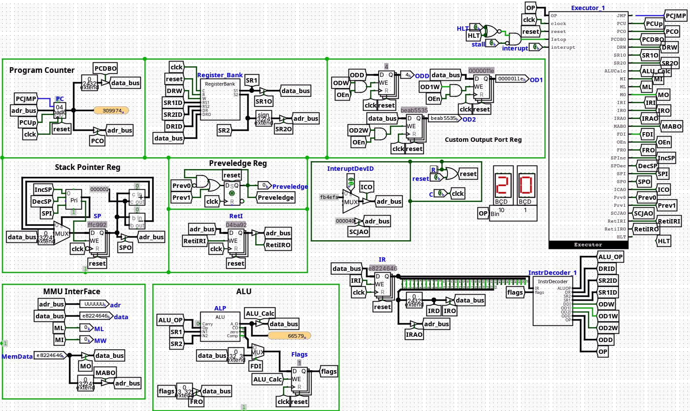
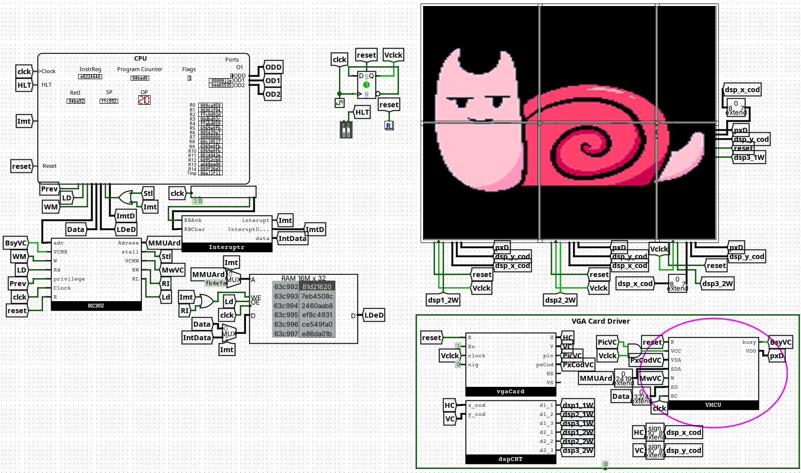
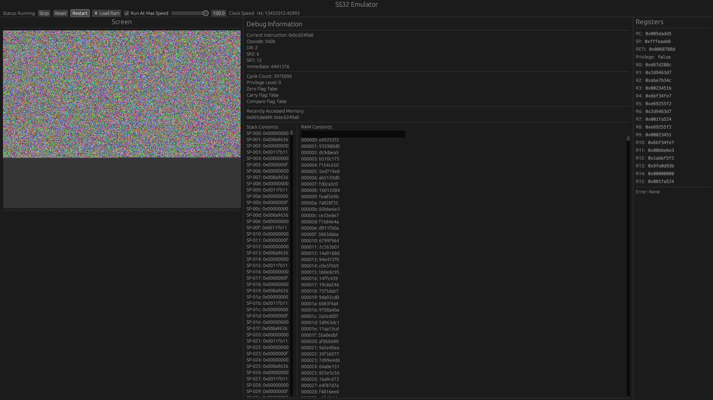

# SS32 CPU
## Overview
The SS32 CPU is a custom-designed minicomputer implemented with TTL. It features a 32-bit data width, 32-bit register width, and a 23-bit address width. The CPU supports a multi-bus architecture and a 9-bit instruction width.



## Components
The SS32 CPU is in the Shit Development, With Many Bugs in the Logisim, Non Latest Assembler, No Documentation, etc.

# Assembler
Assembler Made Using the CustomASM in `assembler/astCPU.asm`.
Just Use CustomASM with the asm file & `astCPU.asm` file

# Emulator
The emulator simulates the SS32 CPU, allowing you to run and test programs on your computer.



# Examples
The examples directory contains example programs that can be run on the SS32 CPU.

# Building the Emulator
To build the emulator, navigate to the `emulator` directory and run:
```bash
cargo build --release
```
